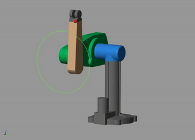

## PUMA560 driven by PMSM

* A project for 《自动化创新实践课程》
* descriptions in detailed available at [link](https://blog.csdn.net/gy_Rick/article/details/109243849)

### platform to run

- [x] win10
- [x] matlab2016b

### directory structure

```
pmsm/
    - pmsmPara.m    # customise your owm PMSM configuration 
    - calPI.m       # calculate PI para for simulink model
    - slx/
        - current.slx   # test current loop
        - revelution.slx
        - postion.slx

puma/
    - stl/   # mechanical model of each link, which is git cloned from https://github.com/nimasarli/puma560_description
    - trajectory/   # some code is git from https://github.com/xuuyann/RobotLearningCode
    - startup_puma.m    # the script run before starting any slx model in puma 

```

### demo

